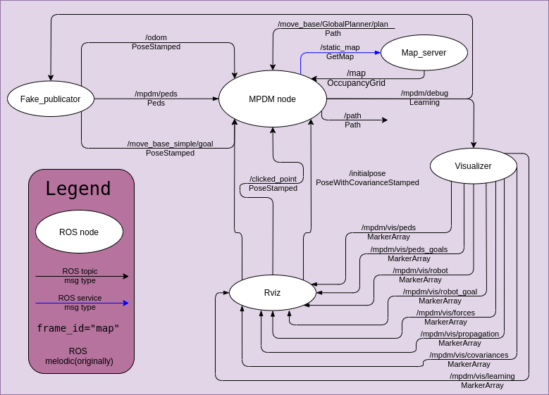

# Backprop-MPDM torch: Multi-policy Decision-making framework for building robot path in social environment #

## Installation ##

### Environment Setup ###

We tested code on ubuntu 18.04 with ROS Melodic, but we didn't use specific features and you can try other versions
First, you need to install Ubuntu 18.04 and ROS melodic. You can find detailed instructions for installation on sites:

https://releases.ubuntu.com/18.04.4/
http://wiki.ros.org/melodic/Installation/Ubuntu

Then, you need to setup ROS for Python3. You can find useful information in that article:
https://medium.com/@beta_b0t/how-to-setup-ros-with-python-3-44a69ca36674

In short, you need to install Python 3 libs for ROS with pip3
```
sudo pip3 install rospkg catkin_pkg
```

### Cloning ###

This is ROS pkg, becouse of this, you need to clone project into catkin workspace:
```
cd ~/catkin_ws/src
git clone https://github.com/alexpostnikov/Backprop-MPDM_torch.git
```

### Build ###

All project on Pytho3, but you need to compille custom ROS msgs that we made for that project

```
cd ~catkin_ws
catkin_make
source ./devel/setup.bash
```
After that you can check compilled msgs:

```
rosmsg list | grep mpdm
```
That command should return you list of msgs like this:
```
mpdm/Learning
mpdm/Ped
mpdm/Peds
mpdm/Propagation
```

## How to run ##

### Data streams diagram ###



### Run ###

(all commands for different terminals)
```
roscore
rosrun mpdm visualiser.py
rosrun mpdm fake_publicator.py
rosrun mpdm node.py
roslaunch mpdm rviz.launch
```
after that you shold see visualisation of working mpdm node in rviz like this:


All goals would update automatically, but also you can set new goal for robot by picking "2D Nav Goal" in Rviz